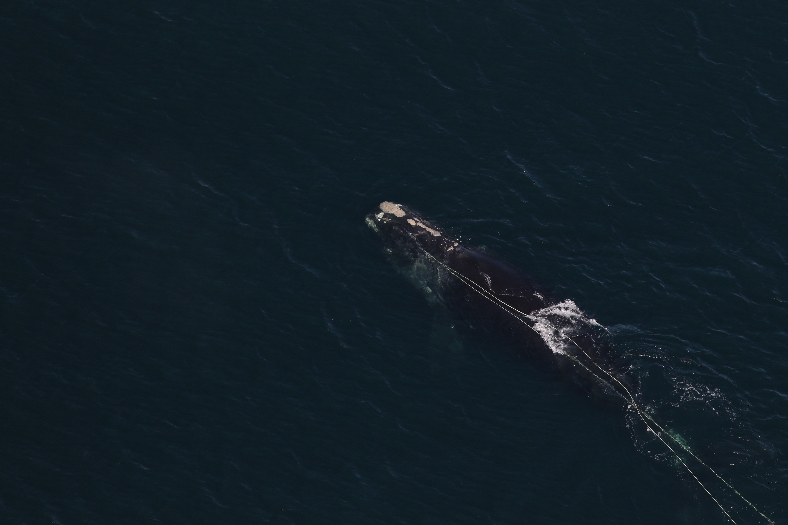

# Serious Injury and Mortality Determination {#aerial_surveys}

We track all events in which large whales are seriously injured or killed by human activities as part of the MMPA requirements. We gather annual large whale data events - both stranding and entanglement - from the US and Canadian Atlantic coast.

