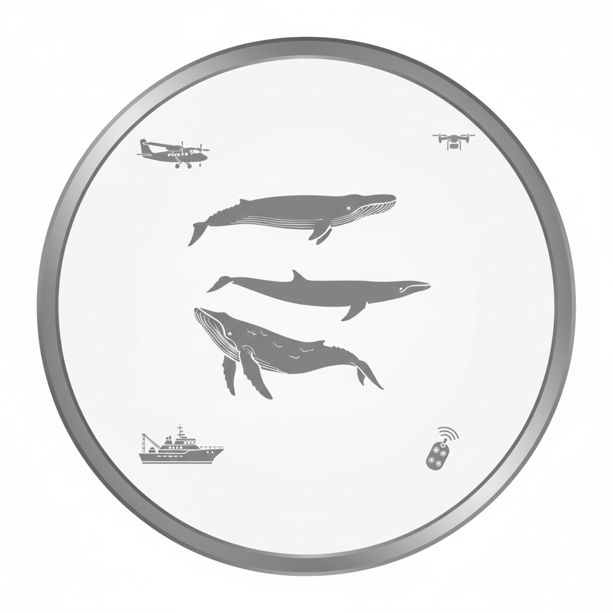

# Welcome to the Whale Ecology Branch! 
{width="25%"} {fig-align="center"}

Welcome to the WEB hive mind. 

This is the lab manual for the Whale Ecology Branch. We are part of the Protected Species Division at the Northeast Fisheries Science Center, primarily based out of the lab in Woods Hole, MA (though some team members are more far flung than that). 

Our work focuses on monitoring the distribution, abudance, ecological relationships and anthropogenic risks for protected large whale species in the northwest Atlantic Ocean.  More about our group's research activity can be found on our [website](https://www.fisheries.noaa.gov/new-england-mid-atlantic/about-us/protected-species-research-northeast){target="_blank"}.

This lab manual resource is intended to provide an overview for branch members and others about how we do our work, and our expectations for our team. It is also a space to document institutional knowledge and for important information about procedures and available resources. If you have suggestions for additions or changes, please contact [Dani] (mailto:danielle.cholewiak@noaa.gov), Beth or others on the team. 

------------------------------------------------------------------------
The content for this book was developed as part of our group's participation in the [Openscapes Champions program](https://openscapes.org){target="_blank"}. We are extremely grateful to [Dr. Julia Stewart Lowndes](https://www.linkedin.com/in/julia-stewart-lowndes/){target="_blank"}' for her role in helping shape how we can use open science tools to improve our science and our communication. 🙌\

[{fig-align="left" width="35px"}](https://github.com/thefaylab/lab-manual){target="_blank"} \< link to this book's GitHub repository. Also see [Quick steps to making a copy of the lab manual and publishing it](https://github.com/thefaylab/lab-manual/wiki/Quick-steps-to-making-a-copy-of-the-lab-manual-&-publishing-it){target="_blank"}!

{width="15%"}
[*We're proud Openscapes Champions!*](https://openscapes.org){target="_blank"}

------------------------------------------------------------------------

{fig-alt="Creative Commons License"}This lab is licensed under a [Creative Commons Attribution 4.0 International License.](http://creativecommons.org/licenses/by/4.0/){target="_blank"}
